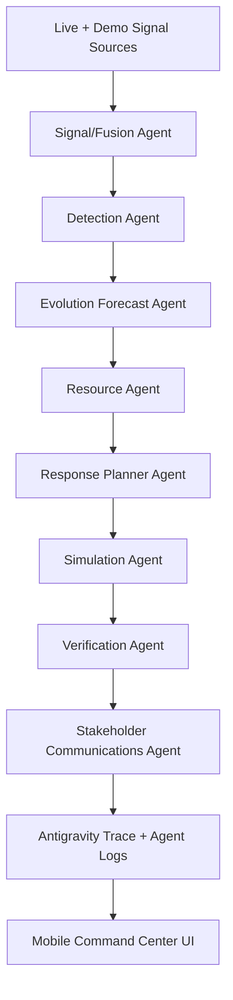
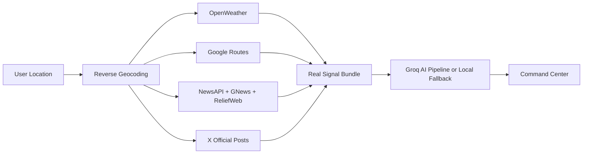

<div align="center">
  

  <h1>CIRO</h1>
  <h3>Crisis Intelligence & Response Orchestrator</h3>

  <p>
    A mobile-first agentic crisis response prototype built for the
    <strong>Google Antigravity Hackathon</strong>.
  </p>

  <p>
    CIRO fuses live and simulated crisis signals, detects emerging incidents,
    predicts severity, allocates constrained resources, simulates response
    impact, and explains decisions in a human-friendly command center.
  </p>

  <p>
    
    
    
    
  </p>
</div>

---

## Table Of Contents

- [Executive Summary](#executive-summary)
- [Challenge Alignment](#challenge-alignment)
- [Product Experience](#product-experience)
- [Technology Stack](#technology-stack)
- [API Integrations](#api-integrations)
- [Demo Modes](#demo-modes)
- [Agentic Architecture](#agentic-architecture)
- [Google Antigravity Orchestration](#google-antigravity-orchestration)
- [Core Data Models](#core-data-models)
- [Real Signal Pipeline](#real-signal-pipeline)
- [Demo Scenarios](#demo-scenarios)
- [Resource Allocation And Simulation](#resource-allocation-and-simulation)
- [Robustness And Recovery](#robustness-and-recovery)
- [Technical Architecture](#technical-architecture)
- [Setup And Run](#setup-and-run)
- [Testing](#testing)
- [Demo Script](#demo-script)
- [Privacy, Safety, Cost, And Latency](#privacy-safety-cost-and-latency)
- [Scalability Roadmap](#scalability-roadmap)
- [Limitations](#limitations)

---

## Executive Summary

Cities rarely receive crisis information through one clean channel. A flood may
appear first as a social post, then as a weather alert, then as a traffic
slowdown, while a field report may contradict the original hypothesis. CIRO is
designed around that messy reality.

CIRO turns fragmented signals into an operational response flow:

1. Ingest signals from social/citizen reports, weather, traffic/routes, mock
   sensors, emergency-call proxies, and field reports.
2. Score credibility, location confidence, urgency, and contradiction level.
3. Detect crisis type, location, severity, confidence, population exposure,
   duration, and likely evolution.
4. Prioritize multiple incidents competing for constrained resources.
5. Simulate dispatch, traffic rerouting, hospital preparation, utility
   escalation, and public messaging.
6. Recover from false positives, false negatives, stale APIs, and conflicting
   sources.
7. Produce Antigravity-ready orchestration traces for judging and auditability.

The prototype is mock-first for reliable judging, while Real Mode can run live
analysis from the user's location using GPS, weather, public/news signals, and
Google routing where API keys are available.

---

## Challenge Alignment

CIRO was built specifically for:

**Challenge 3: Crisis Intelligence & Response Orchestrator (CIRO)**

| Requirement | CIRO Implementation |
| --- | --- |
| Multi-signal fusion | Fuses social/citizen posts, weather, traffic/routes, sensors, field reports, emergency-call proxies, and historical/demo vulnerability hints. |
| Crisis classification | Classifies urban flooding, heatwave, accident, road blockage, power outage, and monitoring states. |
| Severity prediction | Estimates severity, confidence, affected population, affected radius, duration, peak impact, spread risk, and uncertainty. |
| Resource optimization | Ranks constrained ambulances, rescue teams, police units, shelters, pumps, generators, medical teams, and field teams. |
| Multi-crisis coordination | Includes simultaneous flood and heat emergency scenario with explicit trade-offs. |
| Impact simulation | Shows before/after metrics, response time changes, congestion impact, resource cost, and side effects. |
| Stakeholder notification | Generates public, emergency services, hospitals, utility, transport, media, and command-center messages. |
| False positive handling | Includes false flood rumor recovery and alert correction path. |
| False negative handling | Includes low-confidence signal escalation into a high-severity infrastructure response. |
| Degraded mode | Handles missing API keys, stale data, sparse news, route failures, and fallback monitoring. |
| Google Antigravity | Produces structured Antigravity-style orchestration traces across signal interpretation, confidence scoring, ranking, action execution, and recovery. |

---

## Product Experience

CIRO is designed for laypeople and responders, not only technical operators.
The interface avoids raw trace dumps in the main user journey and translates
agent decisions into visual, scannable screens.

Primary screens:

- **Start CIRO** - Choose Demo Mode or Real Mode.
- **Command Center** - Active crisis, signal summary, quick actions, map access,
  and public crisis feed.
- **Crisis Details** - Human-readable incident summary, affected map, stats,
  response preview, and source explanation.
- **Why CIRO Flagged This** - Plain-language explanation of source agreement,
  confidence, location match, urgency, and verification state.
- **Response Plan** - Tactical dispatch timeline and expected impact forecast.
- **Situation Map** - Interactive map with risk filters and route context.
- **Crisis Feed** - Social-style reporting surface for public crisis posts.
- **Notifications** - User-facing alert inbox.
- **Settings/Profile** - Mode switching, location management, and local profile
  persistence.

---

## Technology Stack

| Layer | Technology |
| --- | --- |
| App framework | Flutter |
| Language | Dart `^3.10.8` |
| Routing | `go_router` |
| State pattern | Singleton services with `ListenableBuilder` |
| Local persistence | `shared_preferences` |
| Environment config | `flutter_dotenv` |
| Location | `geolocator`, `permission_handler` |
| Notifications | `flutter_local_notifications` |
| Maps | Google Maps embeds/routes, `google_maps_flutter`, `flutter_map`, `latlong2` |
| Live weather | OpenWeather |
| AI reasoning | Groq OpenAI-compatible API, `llama-3.3-70b-versatile` |
| Public/news signals | NewsAPI, GNews, ReliefWeb public disaster reports |
| Social/public posts | X API official-handle search with public-signal fallback |
| Auth/profile support | Google Sign-In, local profile persistence |
| Styling | Centralized theme tokens in `lib/theme` |
| Testing | `flutter_test`, `flutter analyze` |

---

## API Integrations

CIRO is demo-safe first and API-enhanced when keys are present. Every external
service is optional: missing keys, failed requests, rate limits, or sparse
public data become warnings and fallback signals instead of app crashes.

| API / Service | Environment key | Used for | Fallback |
| --- | --- | --- | --- |
| Groq Chat Completions | `GROQ_API_KEY` | Runs the real-mode AI agent pipeline with `llama-3.3-70b-versatile`. | Local deterministic crisis pipeline and typed fallback outputs. |
| Google Maps / Routes | `GOOGLE_MAPS_API_KEY` | Map support and traffic-aware route delay. | Mock G-10 coordinates and normal route baseline. |
| OpenWeather | `OPENWEATHER_API_KEY` | Live weather, rainfall, heat, humidity, wind, and crisis risk labels. | No-weather-risk signal with a degraded-mode warning. |
| NewsAPI | `NEWS_API_KEY` | Crisis-relevant local public/news articles. | GNews, ReliefWeb, and sparse-data warnings. |
| GNews | `GNEWS_API_KEY` | Additional crisis news search with a free-tier-friendly API. | ReliefWeb public disaster reports. |
| ReliefWeb / UN OCHA | No key | Public disaster-report fallback used by `GnewsSignalService`. | Empty public feed with warning if no relevant results are found. |
| X API | `X_BEARER_TOKEN` | Recent official-handle posts from NDMA, Islamabad administration, police, traffic, and highway authorities. | Converts verified news/public signals into social-style public feed cards. |
| Device/browser location | Runtime permission | User location for Real Mode. | Demo coordinates around G-10, Islamabad. |

The main configuration surface is `lib/services/app_config.dart`. Keys are read
from `.env`, exposed only through service getters and readiness flags, and are
not printed in the UI.

---

## Demo Modes

### Demo Mode

Demo Mode is the primary judging path. It is deterministic, works offline, and
uses curated scenarios around G-10, Islamabad.

Use Demo Mode when:

- Recording the 3-5 minute hackathon video.
- Presenting to judges without network risk.
- Demonstrating false positives, false negatives, and multi-crisis trade-offs.
- Showing stable Antigravity trace outputs.

### Real Mode

Real Mode uses the user's current location and attempts to fetch live signals.
If some APIs are unavailable, CIRO still produces a complete analysis with
clear fallback labeling.

Real Mode can use:

- GPS / browser location through `geolocator`
- Google Geocoding for readable location names
- OpenWeather for current weather risk
- Google Routes for traffic-aware route delay
- NewsAPI, GNews, and ReliefWeb for crisis/public signal hints
- X API official-handle search for recent public authority posts
- Groq for AI-generated crisis classification, response planning, simulation,
  verification, and stakeholder communications
- CIRO-derived proxy signals for feeds that are not publicly accessible, such
  as emergency calls, sensors, and field reports

Real Mode never blocks the demo. Missing or failed APIs are converted into
warnings and fallback signals.

---

## Agentic Architecture

CIRO has two compatible agentic execution paths:

1. **Demo / deterministic pipeline** - Runs curated scenarios through typed
   agent functions for repeatable judging, offline demos, and tests.
2. **Real AI pipeline** - Collects live signals, then asks Groq's
   `llama-3.3-70b-versatile` model to run the same crisis-intelligence roles.
   Each AI call requests strict JSON and every failure falls back to typed local
   defaults.

Both paths produce the same `PipelineResult` shape, so the UI can render crisis
details, response plans, simulation metrics, agent logs, and Antigravity trace
events without caring whether the source was deterministic or AI-assisted.



Agent responsibilities:

| Agent | Responsibility |
| --- | --- |
| Signal / Fusion Agent | Normalizes and fuses weather, traffic, news, social/public, citizen, sensor, emergency-call, and field signals. |
| Detection Agent | Classifies crisis type, severity, confidence, affected people, and incident location. |
| Evolution Forecast Agent | Predicts affected radius, duration, peak impact, spread risk, and uncertainty. |
| Resource Agent | Allocates constrained resources based on impact, urgency, confidence, population, and trade-offs. |
| Response Planner Agent | Builds ordered dispatch actions with owner, ETA, priority, and status. |
| Simulation Agent | Computes before/after operational impact and possible side effects. |
| Verification Agent | Handles confirmed signals, low confidence, conflicts, false positives, and escalation. |
| Stakeholder Communications Agent | Generates public, emergency services, hospital, utility, transport, media, and command-center messages. |
| Antigravity Trace Agent | Emits structured trace events and agent logs for decision evidence and judge review. |

Implementation entry points:

- `lib/services/scenario_engine.dart`
- `lib/agents/agent_pipeline.dart`
- `lib/agents/ai_agent_pipeline.dart`
- `lib/services/groq_service.dart`
- `lib/services/real_signal_service.dart`
- `lib/services/real_scenario_adapter.dart`

---

## Google Antigravity Orchestration

This project is built for the Google Antigravity Hackathon requirement that
multi-agent crisis detection, signal fusion, severity analysis, resource
allocation, stakeholder communication, and action simulation be orchestrated
with traceable reasoning.

CIRO models that orchestration through structured Antigravity trace events:

```dart
class AntigravityTraceEvent {
  final int step;
  final String agent;
  final String action;
  final String input;
  final String output;
  final double confidence;
  final String evidence;
  final Map<String, dynamic> metadata;
}
```

Trace coverage includes:

- Signal interpretation
- Confidence scoring
- Crisis classification
- Priority ranking
- Resource trade-offs
- Stakeholder message generation
- Action execution simulation
- Fallback behavior
- False alarm correction
- Missed detection escalation

The public UI intentionally shows this evidence in simple language through the
**Why CIRO Flagged This** screen. The structured trace remains available through
`ScenarioEngine.instance.antigravityTrace` and
`PipelineResult.antigravityTraceExport` for judging, testing, and future
integration with a dedicated Antigravity trace viewer.

In Real Mode, trace and agent-log entries are labeled with the active engine:
`Groq (Llama 3.3)` when `GROQ_API_KEY` is configured, or
`Local Deterministic` when CIRO is running without an AI key.

Validated by test:

```dart
expect(engine.antigravityTrace.length, greaterThanOrEqualTo(6));
expect(engine.currentResult.antigravityTraceExport, contains('Verification Agent'));
```

---

## Core Data Models

All pipeline outputs are typed. The most important schemas live in `lib/models`.

| Model | Purpose |
| --- | --- |
| `DemoScenario` | Complete scenario fixture: signals, expected crisis, response actions, simulation metrics, side effects, and orchestration hints. |
| `Crisis` | Normalized incident entity with type, location, severity, status, confidence, affected people, and signal summaries. |
| `SignalInput` | Raw incoming source input for social, weather, traffic, citizen, sensor, emergency, and field data. |
| `SignalAssessment` | Credibility, geolocation confidence, urgency score, contradiction level, and source finding. |
| `CrisisEvolution` | Affected radius, population, expected duration, peak impact time, spread risk, and uncertainty range. |
| `ResourceDecision` | Resource assignment, target incident, priority score, reason, and trade-off. |
| `StakeholderNotification` | Tailored message for public, emergency services, hospitals, utilities, transport, media, or command center. |
| `SimulationResult` | Before/after metrics and simulated response actions. |
| `VerificationDecision` | Confirmed, needs verification, conflicting, false positive risk, or escalation required. |
| `PipelineResult` | Complete combined output of the agent pipeline. |

---

## Real Signal Pipeline

Real Mode coordinates live and best-effort public sources:



Source behavior:

| Source | Service | Failure behavior |
| --- | --- | --- |
| Location | `LocationService` | Falls back to demo or monitoring baseline if unavailable. |
| Geocoding | `GeocodingService` | Uses coordinates and coarse labels if reverse geocoding fails. |
| Weather | `WeatherService` | Adds warning and continues with no-weather-risk signal. |
| Routes | `RoutesService` | Adds warning and continues with normal route baseline. |
| News | `NewsSignalService` | Adds sparse-data warning and continues with weather/route/location signals. |
| GNews / ReliefWeb | `GnewsSignalService` | Uses GNews when keyed; otherwise tries ReliefWeb public reports. |
| Social posts | `SocialSignalService` | Uses X API when keyed; otherwise converts public news into social-style signals. |
| AI reasoning | `AiAgentPipeline` + `GroqService` | Uses Groq when keyed; otherwise emits local deterministic fallback outputs. |
| Private feeds | `RealScenarioAdapter` | Creates clearly labeled CIRO-derived proxy signals. |

This keeps the prototype functional even when public APIs are incomplete,
rate-limited, blocked by CORS, or unavailable during a live demo.

---

## Demo Scenarios

Scenario fixtures are defined in:

```text
lib/data/mock_scenarios.dart
```

Recommended judging scenarios:

| Scenario | Demonstrates |
| --- | --- |
| `SCN-001` | Primary G-10 urban flooding flow. |
| `SCN-002` | Accident detection and dispatch planning. |
| `SCN-003` | Low-confidence / needs-verification incident. |
| `SCN-004` | Road blockage and traffic response. |
| `SCN-005` | Heatwave / power-related response path. |
| `SCN-006` | Simultaneous flood and heat emergency with constrained resources. |
| `SCN-007` | Flood vs water-main conflicting signal handling. |
| `SCN-008` | False positive recovery and alert correction. |
| `SCN-009` | False negative escalation after weak early signals intensify. |
| `SCN-REAL` | Real Mode live or degraded monitoring scenario. |

---

## Resource Allocation And Simulation

CIRO models constrained response resources and assigns them based on:

- Crisis severity
- Confidence score
- Affected population
- Urgency language
- Travel/route delay
- Resource availability
- Multi-crisis trade-offs
- Verification state

Example resource classes:

- Ambulances
- Police traffic units
- Rescue teams
- Pump/drainage teams
- Shelters
- Generators
- Water tankers
- Medical outreach teams
- Field verification teams

Simulation outputs include:

- Before state
- Response action
- Expected after state
- Response time improvement
- Congestion impact
- Resource cost
- Possible side effects

The Response Plan screen separates this into:

- **Tactical Steps** - What happens first and who owns it.
- **Expected Impact** - What improves after dispatch begins.

---

## Robustness And Recovery

CIRO explicitly handles uncertainty instead of hiding it.

Recovery cases:

- **False positive** - Viral/social flood report is contradicted by weather,
  traffic, and field verification; public correction is generated.
- **False negative** - Weak early outage report escalates after sensor and
  hospital-call proxies cross thresholds.
- **Conflicting signals** - Flood and water-main hypotheses are both tracked
  until verification resolves the incident type.
- **API downtime** - Missing keys or failed public APIs produce warnings and
  fallback signals.
- **Sparse public data** - No relevant news does not stop the pipeline.
- **Missing location** - Demo baseline and manual location flow remain usable.

---

## Technical Architecture

```text
lib/
  agents/
    agent_pipeline.dart        # Multi-agent pipeline and trace generation
    ai_agent_pipeline.dart     # Groq-powered real-mode agent pipeline
    signal_agent.dart          # Signal normalization placeholder

  components/
    interactive_map_helper.dart
    interactive_map_web.dart
    metric_delta.dart
    premium_card.dart
    severity_badge.dart

  data/
    mock_crises.dart
    mock_scenarios.dart
    mock_signals.dart
    mock_simulations.dart

  models/
    crisis.dart
    demo_scenario.dart
    orchestration_models.dart
    pipeline_result.dart
    route_result.dart
    simulation_result.dart
    social_post_signal.dart
    weather_result.dart

  navigation/
    app_navigator.dart

  screens/
    dashboard_screen.dart
    crisis_detail_screen.dart
    agent_logs_screen.dart
    response_plan_screen.dart
    map_screen.dart
    reports_screen.dart
    notifications_screen.dart
    settings_screen.dart
    profile_screen.dart

  services/
    app_config.dart
    app_mode_service.dart
    geocoding_service.dart
    gnews_signal_service.dart
    groq_service.dart
    location_service.dart
    news_signal_service.dart
    notification_service.dart
    places_service.dart
    post_database_service.dart
    real_signal_service.dart
    real_scenario_adapter.dart
    routes_service.dart
    scenario_engine.dart
    social_signal_service.dart
    user_profile_service.dart
    weather_service.dart

  theme/
    app_theme.dart
    colors.dart
    spacing.dart
    typography.dart
```

Architecture principles:

- Mock-first, real-ready.
- Deterministic demos for judging reliability.
- Typed pipeline outputs instead of ad hoc UI strings.
- Public UI for humans; structured trace data for audit/judging.
- Graceful degradation instead of hard failures.
- Mobile-first visual design with web support.

---

## Setup And Run

### Prerequisites

- Flutter SDK compatible with Dart `^3.10.8`
- Chrome for web testing
- Android Studio / Xcode if testing mobile builds

### Install

```bash
flutter pub get
```

### Environment

Create a root `.env` file:

```env
GOOGLE_MAPS_API_KEY=your_google_maps_or_routes_key
OPENWEATHER_API_KEY=your_openweather_key
NEWS_API_KEY=your_newsapi_key
GNEWS_API_KEY=your_gnews_key
GROQ_API_KEY=your_groq_key
X_BEARER_TOKEN=your_x_api_bearer_token
```

The app still runs without keys. Demo Mode is fully functional offline.
Real Mode becomes progressively richer as keys are added, with Groq enabling
the full AI agent pipeline and the other APIs expanding live signal coverage.

### Run Web

```bash
flutter run -d chrome
```

### Run Android

```bash
flutter run -d android
```

### Build

```bash
flutter build web
flutter build apk --release
```

---

## Testing

Run static analysis:

```bash
flutter analyze
```

Run unit/widget tests:

```bash
flutter test
```

Current automated coverage validates:

- Scenario engine initialization
- Scenario selection
- All five verification states
- Multi-crisis coordination
- Resource trade-off generation
- Antigravity trace generation
- Degraded fallback baseline
- Real Mode adapter conversion from live-like bundles

---

## Demo Script

Suggested 3-5 minute judging flow:

1. Start CIRO and choose **Demo Mode: G-10 Islamabad**.
2. On the Command Center, show active urban flooding, signal cards, map access,
   quick actions, and crisis feed.
3. Open **Crisis Details** to show affected area, confidence, peak impact,
   people at risk, immediate steps, and source summary.
4. Tap **Why?** to show how CIRO explains source agreement in simple language.
5. Open **Response Plan** and show tactical dispatch steps.
6. Switch to **Expected Impact** and show before/after simulated outcomes.
7. Open **Demo Scenarios** and switch to the simultaneous flood + heatwave case
   to show multi-crisis trade-offs.
8. Switch to the false positive recovery scenario and explain how CIRO retracts
   or corrects an alert.
9. Mention that structured Antigravity trace events are generated underneath
   the layman-friendly UI for judge/audit review.

---

## Privacy, Safety, Cost, And Latency

### Privacy

- Demo Mode uses mock data only.
- Profile data is stored locally through `shared_preferences`.
- Real Mode uses location only after user action/permission.
- The prototype does not store real emergency calls, medical records, or
  personally identifiable incident histories.

### Safety

CIRO is a prototype. It is not a replacement for official emergency services.
User-facing language is designed to support preparedness, verification, and
response coordination, not autonomous public-safety enforcement.

### Cost

- Demo Mode: no external API cost.
- Real Mode: limited to user-triggered public API calls.
- Expected hackathon cost: near zero under normal free-tier usage.

### Latency

Typical local behavior:

- Demo Mode: sub-second scenario switching.
- Real Mode: usually 5-15 seconds depending on GPS permission, network,
  weather, routes, and news response time.

---

## Scalability Roadmap

Production evolution path:

1. Replace mock fixtures with streaming adapters for social, weather, traffic,
   311/1122/911-style calls, IoT sensors, field reports, and hospital capacity.
2. Move resource optimization to a server-side service with agency-specific
   inventory and travel-time constraints.
3. Persist Antigravity traces in an immutable incident audit store.
4. Add operator approval queues for public alerts and alert retractions.
5. Integrate real GIS boundaries, flood plains, road graphs, and vulnerability
   maps.
6. Add role-based access for public users, field teams, hospitals, utilities,
   transport authorities, and command centers.
7. Add post-incident analytics and model calibration.

---

## Limitations

- Antigravity traces are prototype orchestration artifacts, not a certified
  incident-command audit system.
- Real Mode depends on public API availability and may have sparse signal data.
- Emergency calls, field reports, and sensor feeds are simulated or derived
  unless connected to real city infrastructure.
- Resource allocation is deterministic and explainable for demo purposes.
- Public alerts should require human approval before production deployment.

---

## Why CIRO Matters

CIRO demonstrates how agentic systems can help cities move from reactive crisis
response to coordinated situational intelligence. The goal is not only to detect
that something is wrong, but to explain why, estimate what happens next, assign
resources responsibly, simulate side effects, communicate clearly, and recover
when early signals are wrong.

That combination - signal fusion, response orchestration, impact simulation,
and transparent recovery - is the heart of CIRO.
